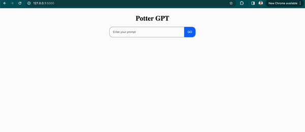

# POTTER GPT (LTSM Language Model for Text Generation)

### Assignment 2 

Submitted by:

Sunil Prajapati

st124073@ait.asia

### Description:
Potter GPT is the text generation model based on Harry Potter franchise. Any prompt related to Harry Potter will produce a coherent sentence
from the model trained on thousands on data related to Harry Potter.

### Repo Strcuture
<pre>
root
|--<a>harrypotter.json (dataset)</a>
|--<a>LSTM_LM.ipyng</a>
|--<a>app</a>
    |--<a>lib</a>
    |--<a>models</a>
    |   |--<a>harrpotter.pt</a>
    |   |--<a>tokenizer.pt</a>
    |   |--<a>vocab.pt</a>
    |
    |--<a>static</a>
    |--<a>templates</a>
    |   |--<a>index.html</a>
    |
    |--<a>app.py</a>
</pre>

### About the datasets

I have compiled the text rich dataset related to Harry Potter from the wiki fandom (https://harrypotter.fandom.com/wiki/Main_Page) site. To extract all the text from the site, I have used two open source tools from github to scrape the text data:

- ScrapeFandom (https://github.com/JOHW85/ScrapeFandom) : To downland and dump all the pages related to harry potter in the wiki fandom site into XML files
- WikiTextExtractor (https://github.com/JOHW85/wikiextractor) : To extract text from the dumped XML file and export it into json file

A custom python script was used to clean up the json from any metadata, and breakdown the paragraphs into sentencnes and formatted necessary to load the data from datasets library. The final result is saved at file `harrypotter.json`. The json file simply contains the list of the extracted sentences.

### Running the app

To run the app, go to the app folder by:

`cd app`

Run the app.py file to start the server

`python3 app.py`

The flask server will start at `http://localhost:5000`

### Demo

